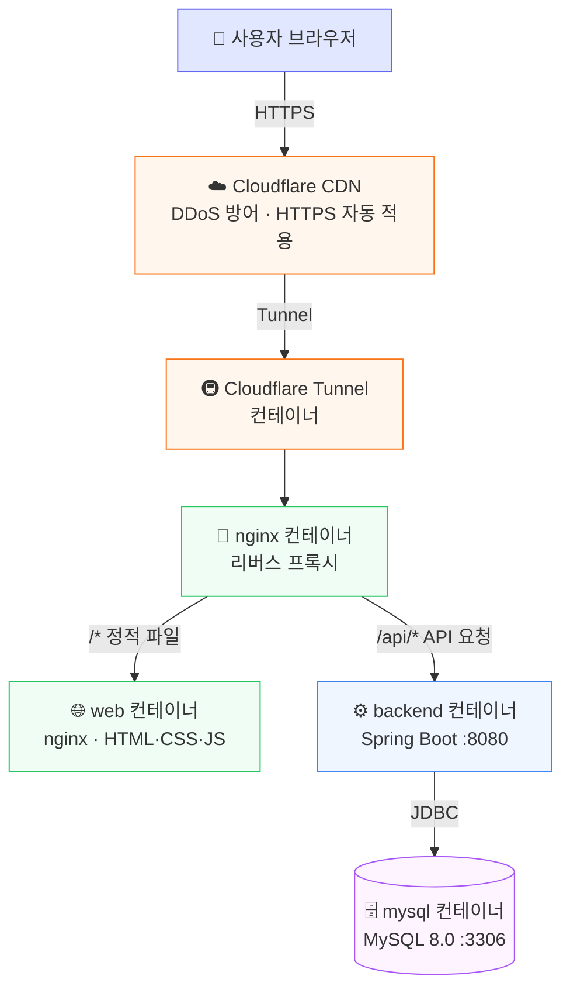
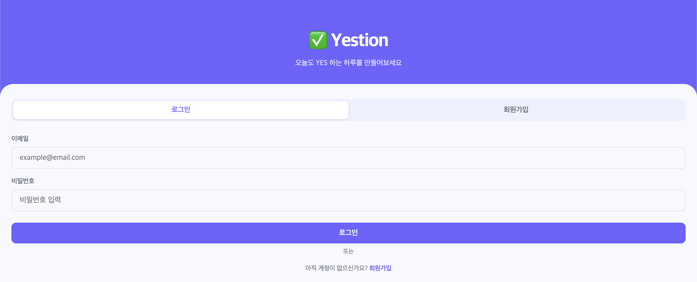
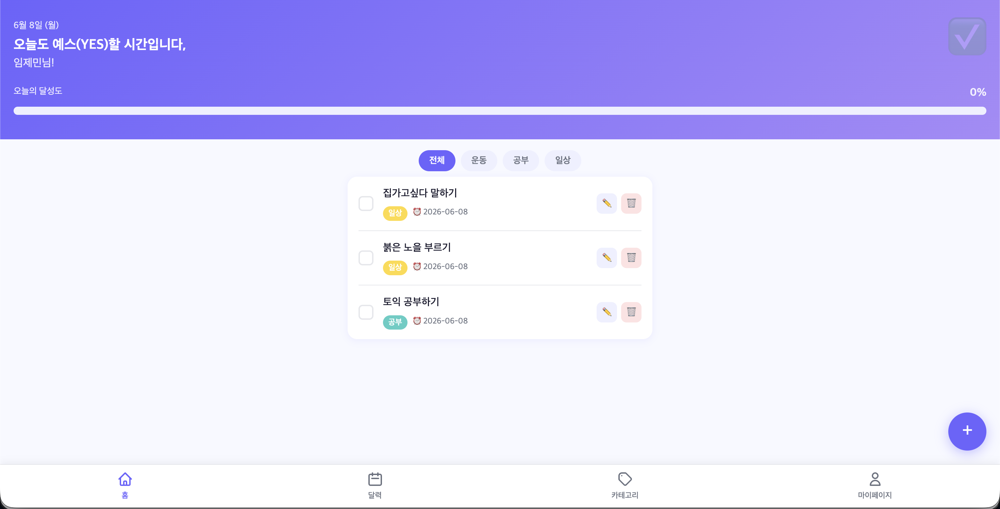
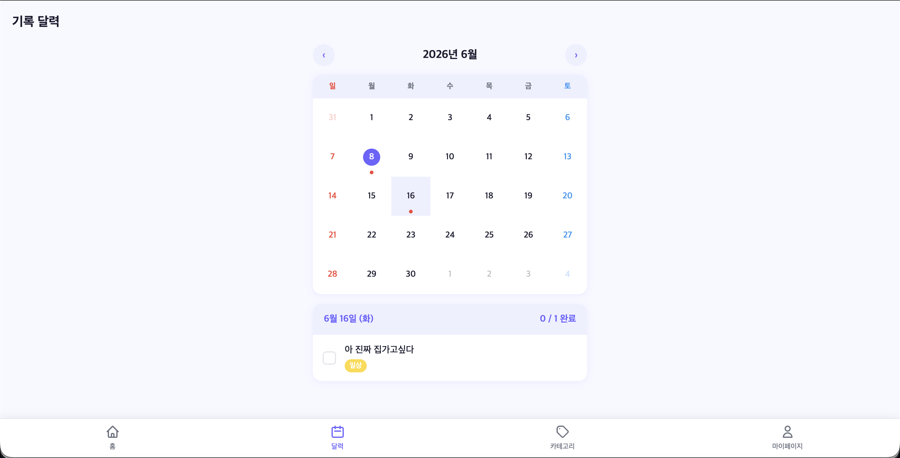
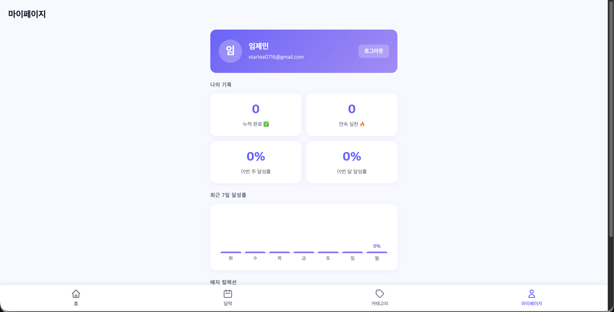

<div align="center">

# ✅ Yestion · 예스션

### *"오늘 해야 할 일에 YES라고 말하는 순간, 당신의 하루가 바뀝니다."*

<br/>


<br/>

🌐 **[yestion.imjemin.co.kr](https://yestion.imjemin.co.kr)** 에서 지금 바로 사용해보세요!

</div>

---

## 💡 서비스 소개

매번 계획만 세우고 실천하지 못한 경험, 한 번쯤 있으시죠?

**예스션(Yestion)** 은 복잡한 기능은 덜어내고, **오늘 바로 행동**할 수 있도록 돕는 모바일 최적화 투두리스트 서비스입니다.
할 일 하나를 체크하는 순간 채워지는 프로그레스 바, 꾸준히 쌓이는 스트릭과 배지 — 작은 성취가 모여 큰 변화를 만들어냅니다.

---

## ✨ 주요 기능

<br/>

### 🔐 로그인 / 회원가입
> 탭 스위칭 UI로 한 화면에서 로그인과 회원가입을 모두 처리

- 이메일 + 비밀번호 기반 인증 (JWT 토큰 발급)
- 닉네임 설정 및 중복 이메일 검증
- BCrypt 비밀번호 암호화

<br/>

### ✅ 오늘 할 일 대시보드
> 오늘 해야 할 일을 한눈에 확인하고 바로 실천

- 날짜 및 개인화 환영 문구 표시
- 체크박스 클릭 시 **실시간 프로그레스 바** 연동
- 카테고리 필터 칩으로 빠른 분류 조회
- 할 일 추가 / 수정 / 삭제

<br/>

### 📅 캘린더 & 기록 보관소
> 달력으로 과거의 실천 기록을 한눈에

- 월별 이동 가능한 달력 UI
- 날짜별 완료율에 따른 🟢 🟠 🔴 도트 표시
- 날짜 클릭 시 해당 날의 투두 목록 동적 로드

<br/>

### 🏷️ 카테고리 관리
> 나만의 카테고리로 할 일을 체계적으로 분류

- 카테고리 이름 + **컬러 픽커**로 자유롭게 생성
- 수정 / 삭제 (할 일이 있는 카테고리 삭제 시 확인 알림)

<br/>

### 👤 마이페이지 & 통계
> 꾸준함이 숫자로 보이는 순간, 동기부여가 달라집니다

- 누적 완료 수 · 연속 실천 스트릭 표시
- 이번 주 / 이번 달 달성률
- **최근 7일 막대 그래프** 시각화
- 배지 컬렉션 (첫 걸음 🌱 · 3일 연속 🔥 · YES 100 🌟 등 6종)

---

## 🖥️ 화면 구성

| 페이지 | 파일 | 설명 |
|--------|------|------|
| 로그인 / 회원가입 | `auth.html` | 탭 스위칭 인증 화면 |
| 홈 | `index.html` | 오늘 할 일 + 프로그레스 바 |
| 할 일 추가·수정 | `todo-detail.html` | 제목 / 날짜 / 카테고리 / 메모 |
| 카테고리 관리 | `category.html` | 컬러 픽커 + CRUD |
| 마이페이지 | `mypage.html` | 통계 그래프 + 배지 |
| 캘린더 | `calendar.html` | 월별 기록 달력 |

---

## 🛠️ 기술 스택

| 분류 | 기술 | 선택 이유 |
|------|------|-----------|
| Frontend | HTML5 · CSS3 · Vanilla JS | 프레임워크 없이 웹 표준만으로 구현 |
| Backend | Spring Boot 3 · Java 21 | 안정적인 REST API, JWT 인증 |
| Database | MySQL 8.0 | 안정적인 관계형 DB |
| Web Server | Nginx | 정적 파일 서빙 + 리버스 프록시 |
| 인프라 | Docker · Docker Compose | 환경 통일, 단일 명령어 실행 |
| DNS / CDN | Cloudflare | 무료 HTTPS · DDoS 방어 · IP 보호 |

---

## 🔌 API 목록

| Method | URI | 설명 | 인증 | 상태 |
|--------|-----|------|------|------|
| POST | `/api/auth/signup` | 회원가입 | ❌ | ✅ 완료 |
| POST | `/api/auth/login` | 로그인 (JWT 발급) | ❌ | ✅ 완료 |
| GET | `/api/todos?date=` | 할 일 목록 조회 | ✅ | 🚧 진행 중 |
| POST | `/api/todos` | 할 일 생성 | ✅ | 🚧 진행 중 |
| PATCH | `/api/todos/{id}` | 할 일 수정 | ✅ | 🚧 진행 중 |
| DELETE | `/api/todos/{id}` | 할 일 삭제 | ✅ | 🚧 진행 중 |
| GET | `/api/categories` | 카테고리 목록 조회 | ✅ | 🚧 진행 중 |
| POST | `/api/categories` | 카테고리 생성 | ✅ | 🚧 진행 중 |
| PATCH | `/api/categories/{id}` | 카테고리 수정 | ✅ | 🚧 진행 중 |
| DELETE | `/api/categories/{id}` | 카테고리 삭제 | ✅ | 🚧 진행 중 |

> 인증이 필요한 요청은 헤더에 `Authorization: Bearer <token>` 을 포함해야 합니다.

---

## 🐳 인프라 아키텍처



| 서비스 | 이미지 | 외부 포트 | 역할 |
|--------|--------|-----------|------|
| `nginx` | nginx:alpine | `:80` | 리버스 프록시 |
| `web` | nginx:alpine | 내부 전용 | 정적 파일 서빙 |
| `backend` | eclipse-temurin:21 | 내부 전용 | REST API |
| `mysql` | mysql:8.0 | `:3310` | 데이터베이스 |

---

## 📁 프로젝트 구조

```
Yestion/
├── docker-compose.yml
├── nginx/
│   └── default.conf              # 리버스 프록시 (/api → backend, / → web)
├── mysql/
│   └── Dockerfile
├── web/
│   ├── Dockerfile
│   ├── nginx.conf
│   └── src/
│       ├── pages/                # HTML 6개
│       ├── css/                  # 공통 + 페이지별 스타일
│       └── js/                   # 공통 유틸 + 페이지별 로직
└── backend/
    ├── Dockerfile
    ├── pom.xml
    └── src/main/java/com/yestion/
        ├── config/               # Security, JWT
        ├── controller/           # API 엔드포인트
        ├── service/              # 비즈니스 로직
        ├── repository/           # DB 접근
        ├── entity/               # DB 테이블 매핑
        └── dto/                  # 요청 / 응답 형식
```

---

## ⚡ 빠른 시작

```bash
# 1. 클론
git clone https://github.com/LogicKingJO/Yestion.git
cd Yestion

# 2. 실행 (Docker Desktop 필요)
docker compose up -d --build

# 3. 접속
open http://localhost/pages/index.html

# API 문서 확인 (Spring Boot 기동 후)
open http://localhost/api
```

```bash
# 중지
docker compose down

# 로그 확인
docker compose logs -f

# 서비스별 로그
docker compose logs -f backend
docker compose logs -f web
```

---

## 📸 미리보기

<div align="center">

| 로그인 | 홈 | 달력 | 마이페이지 |
|--------|-----|------|-----------|
|  |  |  |  |

</div>

---

## 👥 팀원

<div align="center">

<table>
  <tr>
    <td align="center">
      <a href="https://github.com/gunobo">
        <br/>
        <b>gunobo</b>
      </a><br/>
      🎨 Frontend · ⚙️ Backend
    </td>
    <td align="center">
      <a href="https://github.com/2631-Y">
        <br/>
        <b>2631-Y</b>
      </a><br/>
      🗄️ Database
    </td>
  </tr>
</table>

</div>

---

<div align="center">

**Copyright © 2025 Yestion Team. All rights reserved.**

</div>
